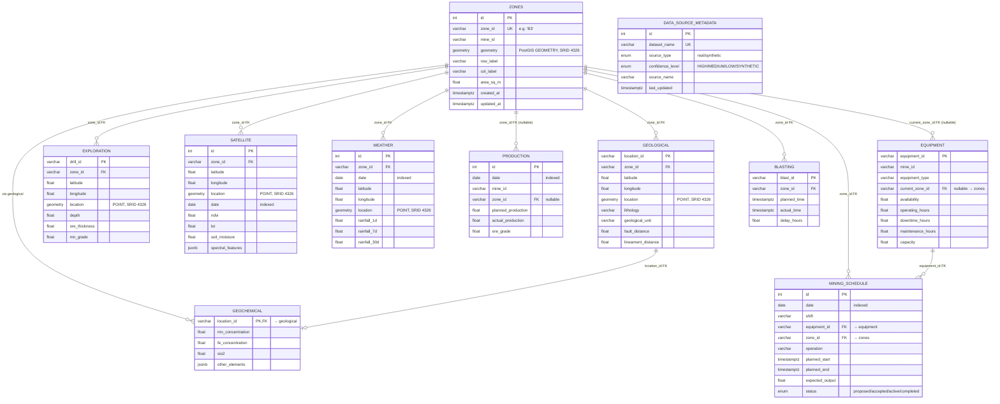

# ERD — Spotter AI Core Schema (Phase 2)

> Matches the Master Data Model (PRD Section 29). Everything hangs off the
> central **zones** grid; per-dataset tables reference `zones.zone_id`.
> Geometry columns are PostGIS types in SRID 4326.

## Legend

- **FK** arrows point from referencing table → referenced table.
- Solid arrows = required FK (NOT NULL), dashed arrows = nullable FK.
- All tables carry `created_at` / `updated_at` (omitted from the diagram for readability).
- All `*_location` / `geometry` columns are PostGIS geometries with a GIST index.

## Diagram (Mermaid)

## Indexes

| Table | Index | Type | Purpose |
| --- | --- | --- | --- |
| zones | `zone_id`, `mine_id` | btree | lookups |
| zones | `geometry` | **GIST** | spatial queries |
| geological / exploration / satellite / weather | `zone_id` | btree | FK joins |
| geological / exploration / satellite / weather | `location` | **GIST** | spatial queries |
| satellite / weather / production / mining_schedule | `date` | btree | time-range queries |
| production | `mine_id`, `zone_id` | btree | aggregation |
| equipment | `mine_id`, `current_zone_id` | btree | fleet/zone lookups |
| blasting | `zone_id` | btree | FK joins |
| mining_schedule | `equipment_id`, `zone_id` | btree | FK joins |

## Notes

- **Geochemical** is 1:1 with **Geological** (same `location_id`); no own `zone_id`
  column — zone resolution goes through `geological.zone_id`.
- **Production.zone_id** and **Equipment.current_zone_id** are nullable by design
  (PRD: production is reported per mine, zone attribution may be unknown;
  equipment may be unassigned/in transit).
- Enum types: `source_type` (real/synthetic), `confidence_level`
  (HIGH/MEDIUM/LOW/SYNTHETIC), `schedule_status` (proposed/accepted/active/completed).
